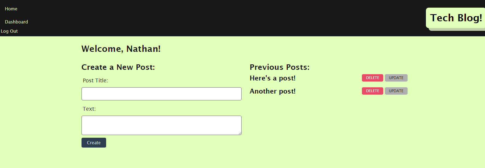

# Tech Blog
  

  ## Description

  The application is a tech blog, which allows a signed up/logged in user to make posts, edit and delete posts, and comment on other posts. The application is deployed through Heroky using the JawsDB add on for the mySQL database component.

## Table of Contents

- [Installation](#installation)
- [Usage](#usage)
- [License](#License)
- [Contributing](#contributing)
- [Tests](#tests)
- [Questions](#questions)
- [Screenshots](#screenshots)
- [Links](#links)

  ## Installation

  No installation is required if using the deployed Heroku page.

  ## Usage

you can view the homepage posts without logging in, but to post, see posts and comments, and edit posts, you must sign up or login.

  ## License

  This project is licensed under the GNU GPLv3 license. Read more about the license here:
  https://choosealicense.com/licenses/gpl-3.0/
  

  ## Contributing

  Please fork and submit a pull request.

  ## Tests

  Test using a variety of inputs.

  ## Questions

  You can reach me at GitHub; my username is nathanh635 and my profile is here: https://github.com/nathanh635. 
  You can also email me at nathanh635@gmail.com. 
  
  ## Screenshots

  Below is a screenshot of the tested application.

  
## Links

  Repository: https://github.com/nathanh635/TechBlog
  
  Deployed webpage: https://pure-island-12653.herokuapp.com/

